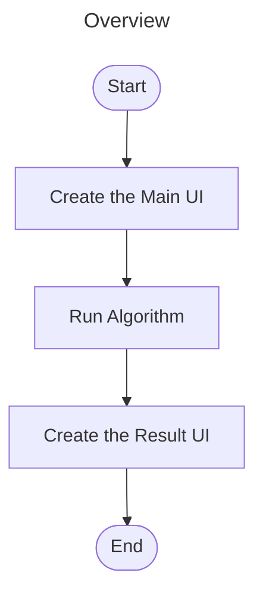

# ♛ N-Queens Visualiser ♛

## Table of Content
| Content                                                                       |
| ---                                                                           |
| 🧩[Problem Statement](#content-problem-statement)                             |
| 🎯[Objective](#content-objective)                                             |
| 🖼️[Preview](#content-preview)                                                 |
| 📖[Terminology](#content-terminology)                                         |
| 💾[About the program](#content-abouttheprogram)                               |
| 🔀[Flowchart](#content-flowchart)                                             |
| 🔮[Future Enhancements](#content-futureenhancements)                          |
| 🚩[Development Issues](#content-developmentissues)                            |
| 🎓[Things Learnt](#content-thingslearnt)                                      |
| 🔗[Links](#content-links)                                                     |

## <p id="content-problem-statement">Problem Statement🧩</p>
The n-queens puzzle is the problem of placing n queens on an `n` x `n` chessboard such that no two queens attack each other.

## <p id="content-objective">Objective🎯</p>
Given an integer `n`, we must display all distinct solutions to the *n-queens puzzle*

## <p id="content-preview">Preview🖼️</p>
### Main Window
![Main Window of the program][directorylink-image-programmainwindow]
### Result Window    
![Result Window of the program][directorylink-image-programresultwindow]
## <p id="content-terminology">Terminology📖</p>
- Rank
    - In chess, a rank refers to a straight full set of squares on the horizontal axis
- File
    - In chess, a file refers to a straight full set of squares on the vertical axis
- Frame
    - A frame is a window using by java
- Panel
    - A panel is a section within a frame

## <p id="content-abouttheprogram">About the program💾</p>
<!-- ### Time and Space complexity -->
- ### Programming Language used
    - Java
- ### Package(s) used
    - java.util.Scanner
        - To take input from the user
    - java.util.List
        - To store the answer/results with a list    
    - java.util.ArrayList
        - To instantiate an abstract list
    - import java.awt
        - To create *Abstract Window Toolkit*
    import javax.swing.*;
        - Easy to use GUI components

<!-- ### Functions -->


## <p id="content-flowchart">Flowchart🔀</p>
### Over View

### Rendering the Live Preview

```mermaid
---
title: Rendering the Live Preview
---
flowchart
    StartPlaceQueen(["Start of placeQueen(Function)"])
    VisuallyPlaceQueen[Visually Place Queen]
    DecisionQueenPositionIsValid{"
        Is
        Queen placed at
        Valid Square
    "}
    VisuallyRemoveQueen["
        Visually Remove
        Last Placed Queen
    "]
    BackTrack([Perform Back Tracking])
    EndPlaceQueen(["
        Run placeQueen()
        for next queen
    "])

    
    StartPlaceQueen --> VisuallyPlaceQueen --> CheckingForOtherQueens
    
    %% Checking for other queens
    subgraph CheckingForOtherQueens [Checking for other queens]
        direction TB
        StartChecking([Start Checking])
        CheckReturnStateSameFile{"
            Is
            The file clear of
            other queens
        "}
        CheckReturnStateLeftDiagonal{"
            Is
            The Left Diagonal
            clear of other queens
        "}
        CheckReturnStateRightDiagonal{"
            Is
            The Right Diagonal
            clear of other queens
        "}
        
        ReturnTrue([Return True])
        ReturnFalse([Return False])
        
        %% SubgraphSameFileCheck
        subgraph SubgraphSameFileCheck [Checking in the same file]
            direction TB
            SameFileCheckIfSquareIsValid{"
                If
                Square
                is Valid
            "}
            SameFileHighlightValid["HighLight as Valid Square✅"]
            SameFileSqaureWithinOfBoard{"
                Is
                Next Sqaure on
                the same file still
                within the Board
            "}
            SameFileReturnTrue([Return true])
            SameFileHighlightInvalid["HighLight as Invalid Square❌"]
            SameFileNavigateToNextSquare["
                Navigate to Next Square
                of Same File
            "]
            SameFileClearHighlights[Clear All Highlights]
            SameFileRevertPosition["
                Revert board position to
                last non-conflict position
            "]
            SameFileReturnFalse([Return false])
            
            %% SameFileCheckIfSquareIsValid
                SameFileCheckIfSquareIsValid --> |Yes🟢| SameFileHighlightValid --> SameFileNavigateToNextSquare --> SameFileSqaureWithinOfBoard 
                SameFileCheckIfSquareIsValid --> |No🔴| SameFileHighlightInvalid --> SameFileClearHighlights --> SameFileRevertPosition --> SameFileReturnFalse
            
            %% SameFileSqaureWithinOfBoard
                SameFileSqaureWithinOfBoard -->|Yes🟢| SameFileCheckIfSquareIsValid
                SameFileSqaureWithinOfBoard -->|No🔴| SameFileReturnTrue
        end

        %% SubgraphLeftDiagonalCheck
        subgraph SubgraphLeftDiagonalCheck [Checking in the Left Diagonal]
            direction TB
            LeftDiagonalCheckIfSquareIsValid{"
                If
                Square
                is Valid
            "}
            LeftDiagonalHighlightValid["HighLight as Valid Square✅"]
            LeftDiagonalSqaureWithinOfBoard{"
                Is
                Next Sqaure on
                the Left Diagonal still
                within the Board
            "}
            LeftDiagonalReturnTrue([Return true])
            LeftDiagonalHighlightInvalid["HighLight as Invalid Square❌"]
            LeftDiagonalNavigateToNextSquare["
                Navigate to Next Square
                of Left Diagonal
            "]
            LeftDiagonalClearHighlights[Clear All Highlights]
            LeftDiagonalRevertPosition["
                Revert board position to
                last non-conflict position
            "]
            LeftDiagonalReturnFalse([Return false])
            
            %% LeftDiagonalCheckIfSquareIsValid
                LeftDiagonalCheckIfSquareIsValid --> |Yes🟢| LeftDiagonalHighlightValid --> LeftDiagonalNavigateToNextSquare --> LeftDiagonalSqaureWithinOfBoard 
                LeftDiagonalCheckIfSquareIsValid --> |No🔴| LeftDiagonalHighlightInvalid --> LeftDiagonalClearHighlights --> LeftDiagonalRevertPosition --> LeftDiagonalReturnFalse
            
            %% LeftDiagonalSqaureWithinOfBoard
                LeftDiagonalSqaureWithinOfBoard -->|Yes🟢| LeftDiagonalCheckIfSquareIsValid
                LeftDiagonalSqaureWithinOfBoard -->|No🔴| LeftDiagonalReturnTrue
        end

        %% SubgraphRightDiagonalCheck
        subgraph SubgraphRightDiagonalCheck [Checking in the Right Diagonal]
            direction TB
            RightDiagonalCheckIfSquareIsValid{"
                If
                Square
                is Valid
            "}
            RightDiagonalHighlightValid["HighLight as Valid Square✅"]
            RightDiagonalSqaureWithinOfBoard{"
                Is
                Next Sqaure on
                the Right Diagonal still
                within the Board
            "}
            RightDiagonalReturnTrue([Return true])
            RightDiagonalHighlightInvalid["HighLight as Invalid Square❌"]
            RightDiagonalNavigateToNextSquare["
                Navigate to Next Square
                of Right Diagonal
            "]
            RightDiagonalClearHighlights[Clear All Highlights]
            RightDiagonalRevertPosition["
                Revert board position to
                last non-conflict position
            "]
            RightDiagonalReturnFalse([Return false])
            
            %% RightDiagonalCheckIfSquareIsValid
                RightDiagonalCheckIfSquareIsValid --> |Yes🟢| RightDiagonalHighlightValid --> RightDiagonalNavigateToNextSquare --> RightDiagonalSqaureWithinOfBoard 
                RightDiagonalCheckIfSquareIsValid --> |No🔴| RightDiagonalHighlightInvalid --> RightDiagonalClearHighlights --> RightDiagonalRevertPosition --> RightDiagonalReturnFalse
            
            %% RightDiagonalSqaureWithinOfBoard
                RightDiagonalSqaureWithinOfBoard -->|Yes🟢| RightDiagonalCheckIfSquareIsValid
                RightDiagonalSqaureWithinOfBoard -->|No🔴| RightDiagonalReturnTrue
        end
        
        StartChecking --> SubgraphSameFileCheck --> CheckReturnStateSameFile
        %% CheckReturnStateSameFile
            CheckReturnStateSameFile --> |Yes🟢| SubgraphLeftDiagonalCheck
            CheckReturnStateSameFile --> |No🔴| ReturnFalse

        SubgraphLeftDiagonalCheck --> CheckReturnStateLeftDiagonal
        %% CheckReturnStateLeftDiagonal
            CheckReturnStateLeftDiagonal --> |Yes🟢| SubgraphRightDiagonalCheck
            CheckReturnStateLeftDiagonal --> |No🔴| ReturnFalse
        
        SubgraphRightDiagonalCheck --> CheckReturnStateRightDiagonal
        %% CheckReturnStateRightDiagonal
            CheckReturnStateRightDiagonal --> |Yes🟢| ReturnTrue
            CheckReturnStateRightDiagonal --> |No🔴| ReturnFalse
    end


    CheckingForOtherQueens --> DecisionQueenPositionIsValid

    %% DecisionQueenPositionIsValid
        DecisionQueenPositionIsValid --> |Yes🟢| EndPlaceQueen
        DecisionQueenPositionIsValid --> |No🔴| VisuallyRemoveQueen
    
    VisuallyRemoveQueen --> BackTrack
```


## <p id="content-futureenhancements">Future Enhancements🔮</p>
- ### Better error handling
    - Implement error handling when a non-valid integer is entered as the number of queens
    - Implement error handling for the function `buttonCompute.addActionListener()`


## <p id="content-developmentissues">Development Issues Faced🚩</p>
- ### Stretched out grid when using `GridLayout`
    - #### Cause of the problem
        - Grid Layout did not respect the panel's preferred size
    - #### Solution
        - Set the size of panel with the grid layout with `setPreferredSize` instead of `setSize`, example:
            - Use:
                ```java
                panelChessBoard.setPreferredSize(new Dimension(boardLength, boardLength));
                ```
            - Instead of:
                ```java
                panelChessBoard.setSize(boardLength, boardLength);
                ```
        - Add the panel to the Frame using a wrapper:
            ```java
            JPanel wrapperPanel = new JPanel(new FlowLayout(FlowLayout.CENTER));
            wrapperPanel.add(panelLivePreview);
            frameMain.add(wrapperPanel);
            frameMain.pack();
            ```

## <p id="content-thingslearnt">Things Learnt🎓<p>
- Using packages catered for rendering graphical items
- Handling threads

## <p id="content-links">Links🔗</p>
- About the problem:
    - By [LeetCode][weblink-leetcode-question]
- Completed project reference:
    - By [GSR][weblink-project-reference1]
- Drawing a chess board in Java:
    - By [GUIProjects][weblink-guiprojects-chessboarddrawing]


[weblink-leetcode-question]: https://leetcode.com/problems/n-queens/
[weblink-project-reference1]: https://nqueensvisualizerbygsr.netlify.app/
[weblink-guiprojects-chessboarddrawing]: https://guiprojects.com/how-to-draw-a-chessboard-in-java/

[directorylink-image-planning]: ./docs/images/planning.png
[directorylink-image-programmainwindow]: ./docs/images/program_mainwindow.png
[directorylink-image-programresultwindow]: ./docs/images/program_resultwindow.png
<!--
Requirements:
Deadline: before 13th July 2024.
Topics:
    1. Nqueens visualiser
    2. Sudoku solver visualiser 
Additional Requirements:
    - PPT
    - Report
    - Code uploaded to our personal GitHub Account
-->